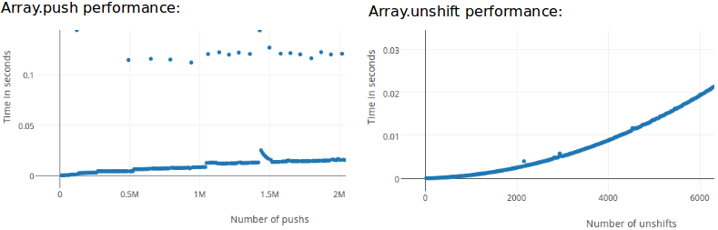

## 问题描述

最近在做大屏项目，涉及到拖拽问题，我设计的是让最新拖拽的组件在最顶层(为了偷懒，图层列表直接拿组件列表就可以)，信心满满不会出任何问题，后面调试的过程中，发生浏览器频繁崩溃的问题，但是只是偶尔发生，就没过多在意。

## 原因分析

经过断点排查时，最终将问题定位在更新组件列表操作上，发现正是我之前为了偷懒写的`unshift`出现的问题。因为之前很少使用这个方法，所以为了验证，自己做了个简单的对比实验。

```js
/*UNSHIFT*/
var unArr = [];
console.time("unshift");

for (let j = 0; j < 100000; j++) {
  unArr.unshift(j);
}

console.timeEnd("unshift");

/*PUSH*/
var puArr = [];
console.time("push");

for (let i = 0; i < 100000; i++) {
  puArr.push(i);
}

console.timeEnd("push");
```

```shell
# the first time

unshift: 948.592ms
push: 3.737ms

# the second time

unshift: 943.298ms
push: 3.428ms

# the third time

unshift: 936.947ms
push: 3.403ms
```

通过以上结果对比，可以发现，在数量相同(100000)的情况下，`unshift`方法操作所花的时间是`push`的 300 多倍(不同系统或有差异)，这是因为`unshift`方法是将数据添加到数组的前面，也就意味着原有元素的位置将要向后移一位，而`push`则直接添加到数组最后，不对其他元素的位置造成影响，也就少去了更换位置的步骤，如果数量够多，差距将呈指数增加。
下图为网络资料，可参考



那么，如果我们要实现这种方法，应该怎么做呢？

## 解决方法

可将`unshift`分解为`push` + `reverse`来实现同样的效果,为了保险起见，我这里也准备了一个测试代码

```js
// /*UNSHIFT*/
const arr1 = [];

console.time("time1");

for (let i = 0; i < 10000; i++) {
  arr1.unshift(i);
}
console.timeEnd("time1");

// /*PUSH + REVERSE*/

const arr2 = [];
console.time("time2");

for (let j = 0; j < 10000; j++) {
  arr2.push(j);
}
arr2.reverse();
console.timeEnd("time2");
```

```shell
# the first time

time1: 9.87ms
time2: 0.443ms

# the second time

time1: 9.747ms
time2: 0.428ms

# the third time

time1: 9.691ms
time2: 0.446ms
```

以上实验可以看出，`push + reverse`两种操作加起来所用时间也只是`unshift`的`1/22`而已。
