💡 微信小程序的注册主要分为两部分：第一步是注册公众平台账号，第二步是在公众平台上注册小程序。

## 一、注册公众平台账号

> 需要准备一个全新的微信号和邮箱，要求是没有绑定过任何小程序、公众号、个人微信之类。准备好之后继续下面的步骤。

### 1. 扫码登陆

打开网站：[微信公众平台](https://mp.weixin.qq.com/) ，用新的微信号扫码登陆会出现如图的提示，点击【现在去注册】按钮。

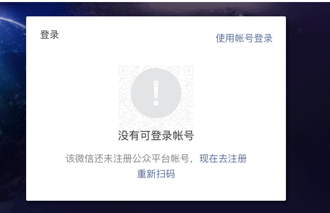

### 2. 选择注册类型

点击【现在去注册】按钮之后，会跳转到注册账号类型的选择页面(如下图)，继续点击【小程序】

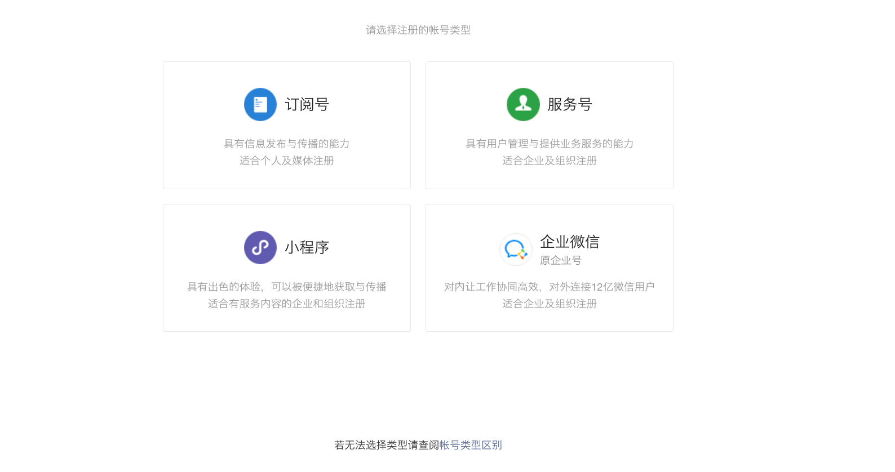

### 3. 小程序注册

选择之后会跳转到小程序注册页面(如下图一)，这时需要你填写一些基本信息，如邮箱、密码等，填写之后点击【注册】，系统会给你的邮箱发送一封确认邮件(如下图二)，你需要登陆邮箱进行确认，如果没有，就点击一下垃圾邮件看一下。

- 图一

  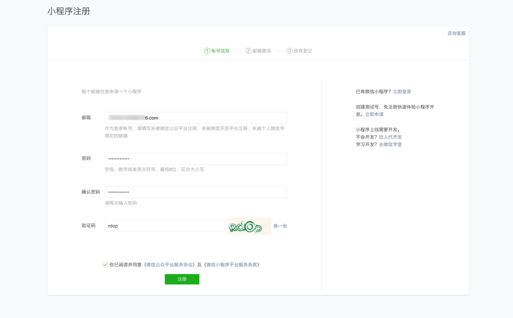

- 图二

  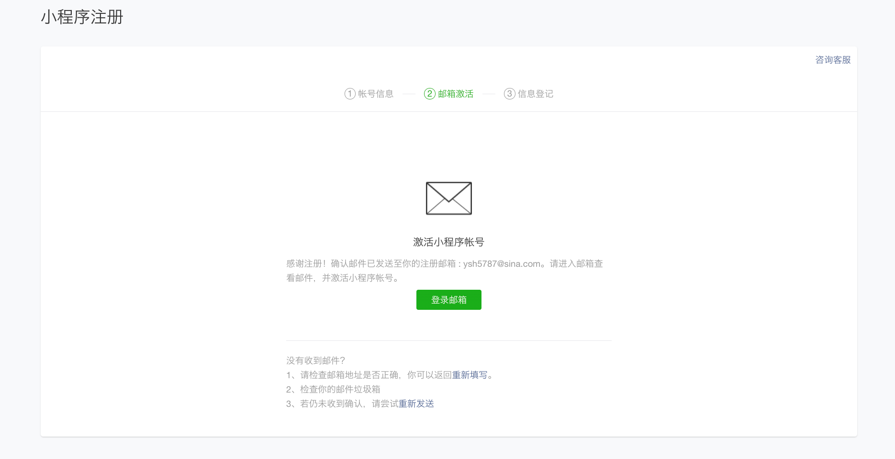

### 4. 用户信息登记

激活邮件中内容如图，点击链接进入小程序注册界面。按照实际情况填写，个人的比较简单，进行个实名认证就可以了。

- 激活邮件

  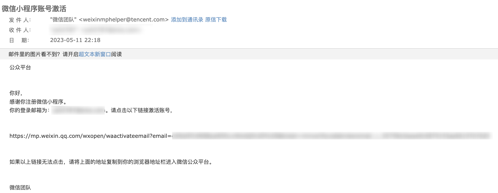

- 信息登记

  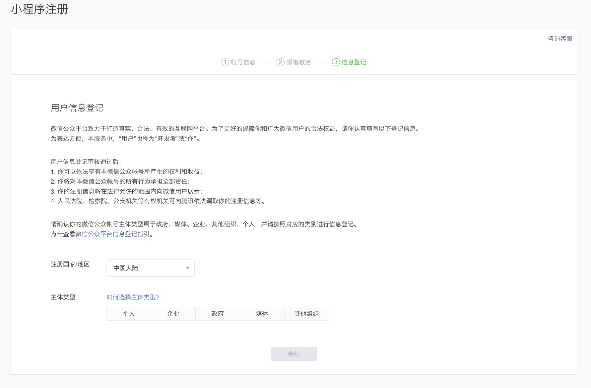

- 信息提交

  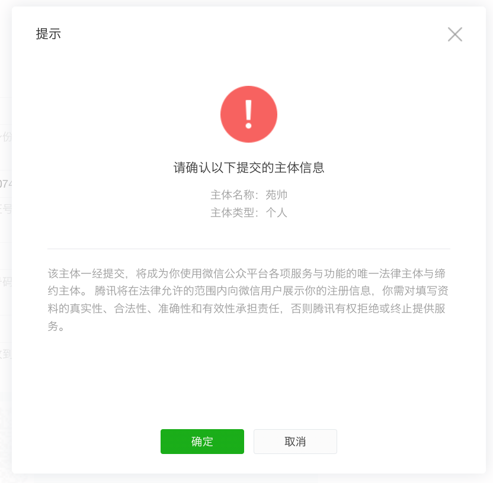

- 信息提交成功

        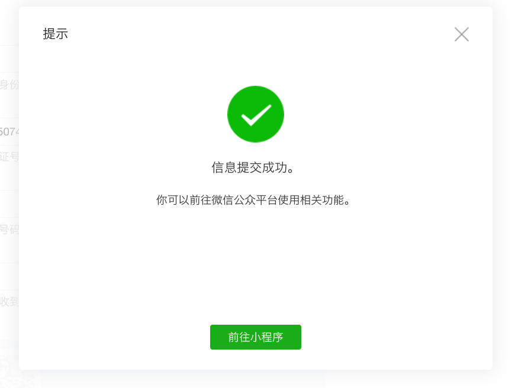

至此，小程序便注册成功，点击前往小程序进行信息完善、`AppId` 获取、`AppSecret` 获取、开发人员设置等

---

二、添加项目成员

点击左侧【成员管理】，然后点击项目成员列表右侧的编辑按钮，通过微信号搜索相关项目成员并勾选权限后确认添加即可

- 成员管理

  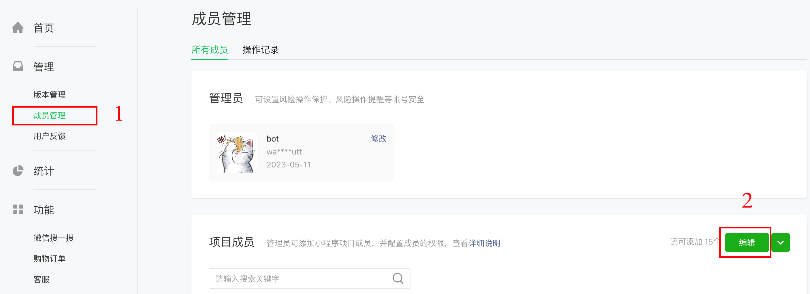

- 添加用户*（如果搜索不到，可检查微信号是否正确，以及确保对方“微信-我-设置-朋友权限-添加我的方式”中的“通过微信号找到我”选项处于打开状态。）*
  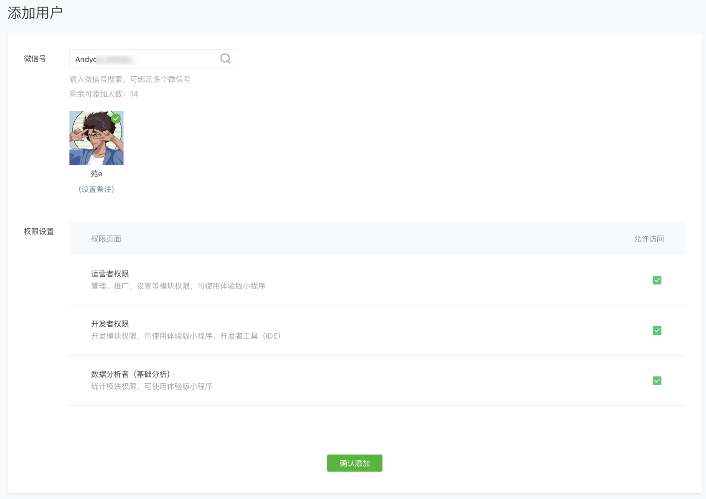

只有以上被添加的用户即可参与到项目的开发当中。

---

三、查看小程序 `AppId` 和 `AppSecret`

- 点击左侧的菜单中的开发管理

  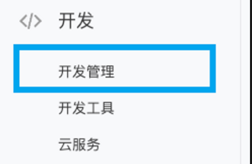

点击标签页中的【开发设置】，会出现两条信息，一个是 `AppId` ，另一个是需要点击【生成按钮】才会出现的 `AppSecret`

💡 切记这个 `AppSecret` 密钥只会出现一次，生成后马上存储起来，存到手机或者记事本等，否则还需要重置，如果小程序上线了，就需要重新发布了，影响很大。

- 开发设置界面

  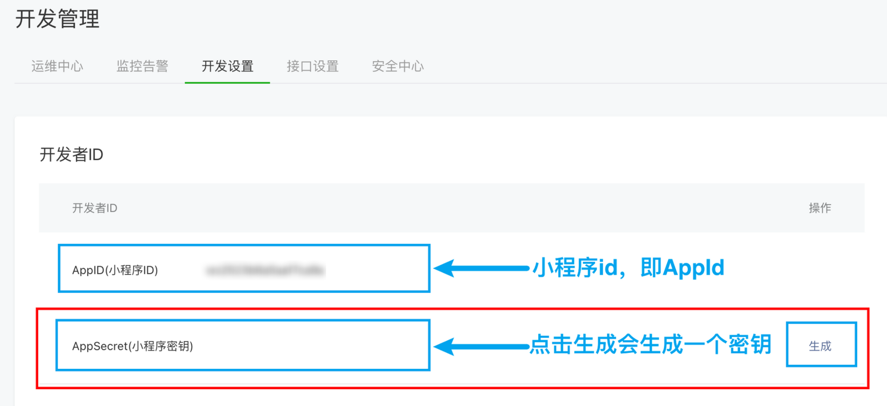

将获取到的`AppId` 和 `AppSecret` 分享给项目开发成员即可，至此，一个小程序便已注册完成 ✅
