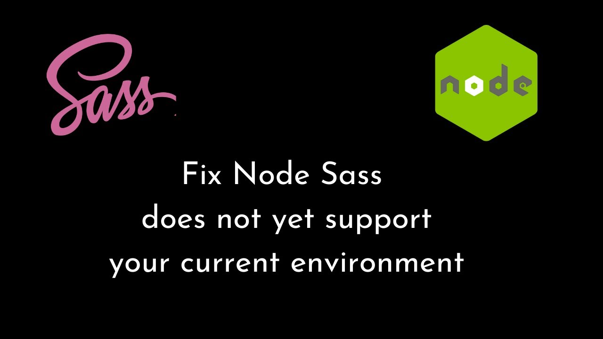

## 问题描述

安装依赖时报错，而且时一堆让人头皮发麻不明所以的信息，如下：

```shell
pm ERR! code 1
npm ERR! path D:\admin\db-api-dev\dbapi-ui\node_modules\node-sass
npm ERR! command failed
npm ERR! command C:\Windows\system32\cmd.exe /d /s /c node scripts/build.js
npm ERR! Building: C:\Program Files\nodejs\node.exe D:\admin\db-api-dev\dbapi-ui\node_modules\node-gyp\bin\node-gyp.js rebuild --verbose --libsass_ext= --libsass_cflags= --libsass_ldflags= --libsass_library=
npm ERR! gyp info it worked if it ends with ok
npm ERR! gyp verb cli [
npm ERR! gyp verb cli   'C:\\Program Files\\nodejs\\node.exe',
npm ERR! gyp verb cli   'D:\\admin\\db-api-dev\\dbapi-ui\\node_modules\\node-gyp\\bin\\node-gyp.js',
npm ERR! gyp verb cli   'rebuild',
npm ERR! gyp verb cli   '--verbose',
npm ERR! gyp verb cli   '--libsass_ext=',
npm ERR! gyp verb cli   '--libsass_cflags=',
npm ERR! gyp verb cli   '--libsass_ldflags=',
npm ERR! gyp verb cli   '--libsass_library='
npm ERR! gyp verb cli ]
npm ERR! gyp info using node-gyp@7.1.2
npm ERR! gyp info using node@16.16.0 | win32 | x64
npm ERR! gyp verb command rebuild []
npm ERR! gyp verb command clean []
npm ERR! gyp verb clean removing "build" directory
npm ERR! gyp verb command configure []
npm ERR! gyp verb find Python checking Python explicitly set from command line or npm configuration
npm ERR! gyp verb find Python - "--python=" or "npm config get python" is "D:\Python27\python.exe"
npm ERR! gyp verb find Python - executing "D:\Python27\python.exe" to get executable path
npm ERR! gyp verb find Python - executable path is "D:\Python27\python.exe"
npm ERR! gyp verb find Python - executing "D:\Python27\python.exe" to get version
npm ERR! gyp verb find Python - version is "2.7.15"
npm ERR! gyp info find Python using Python version 2.7.15 found at "D:\Python27\python.exe"
npm ERR! gyp verb get node dir no --target version specified, falling back to host node version: 16.16.0
npm ERR! gyp verb command install [ '16.16.0' ]
npm ERR! gyp verb install input version string "16.16.0"
npm ERR! gyp verb install installing version: 16.16.0
npm ERR! gyp verb install --ensure was passed, so won't reinstall if already installed
npm ERR! gyp verb install version is already installed, need to check "installVersion"
npm ERR! gyp verb got "installVersion" 9
npm ERR! gyp verb needs "installVersion" 9
npm ERR! gyp verb install version is good
npm ERR! gyp verb get node dir target node version installed: 16.16.0
npm ERR! gyp verb build dir attempting to create "build" dir: D:\admin\db-api-dev\dbapi-ui\node_modules\node-sass\build
npm ERR! gyp verb build dir "build" dir needed to be created? D:\admin\db-api-dev\dbapi-ui\node_modules\node-sass\build
npm ERR! gyp verb find VS msvs_version was set from command line or npm config
npm ERR! gyp verb find VS - looking for Visual Studio version 2017
npm ERR! gyp verb find VS VCINSTALLDIR not set, not running in VS Command Prompt
npm ERR! gyp verb find VS could not use PowerShell to find Visual Studio 2017 or newer, try re-running with '--loglevel silly' for more details
npm ERR! gyp verb find VS looking for Visual Studio 2015
npm ERR! gyp verb find VS - not found
npm ERR! gyp verb find VS not looking for VS2013 as it is only supported up to Node.js 8
npm ERR! gyp ERR! find VS
npm ERR! gyp ERR! find VS msvs_version was set from command line or npm config
npm ERR! gyp ERR! find VS - looking for Visual Studio version 2017
npm ERR! gyp ERR! find VS VCINSTALLDIR not set, not running in VS Command Prompt
npm ERR! gyp ERR! find VS could not use PowerShell to find Visual Studio 2017 or newer, try re-running with '--loglevel silly' for more details
npm ERR! gyp ERR! find VS looking for Visual Studio 2015
npm ERR! gyp ERR! find VS - not found
npm ERR! gyp ERR! find VS not looking for VS2013 as it is only supported up to Node.js 8
npm ERR! gyp ERR! find VS
npm ERR! gyp ERR! find VS valid versions for msvs_version:
npm ERR! gyp ERR! find VS
npm ERR! gyp ERR! find VS **************************************************************
npm ERR! gyp ERR! find VS You need to install the latest version of Visual Studio
npm ERR! gyp ERR! find VS including the "Desktop development with C++" workload.
npm ERR! gyp ERR! find VS For more information consult the documentation at:
npm ERR! gyp ERR! find VS https://github.com/nodejs/node-gyp#on-windows
npm ERR! gyp ERR! find VS **************************************************************
npm ERR! gyp ERR! find VS
npm ERR! gyp ERR! configure error
npm ERR! gyp ERR! stack Error: Could not find any Visual Studio installation to use
npm ERR! gyp ERR! stack     at VisualStudioFinder.fail (D:\admin\db-api-dev\dbapi-ui\node_modules\node-gyp\lib\find-visualstudio.js:121:47)
npm ERR! gyp ERR! stack     at D:\admin\db-api-dev\dbapi-ui\node_modules\node-gyp\lib\find-visualstudio.js:74:16
npm ERR! gyp ERR! stack     at VisualStudioFinder.findVisualStudio2013 (D:\admin\db-api-dev\dbapi-ui\node_modules\node-gyp\lib\find-visualstudio.js:351:14)
npm ERR! gyp ERR! stack     at D:\admin\db-api-dev\dbapi-ui\node_modules\node-gyp\lib\find-visualstudio.js:70:14
npm ERR! gyp ERR! stack     at D:\admin\db-api-dev\dbapi-ui\node_modules\node-gyp\lib\find-visualstudio.js:372:16
npm ERR! gyp ERR! stack     at D:\admin\db-api-dev\dbapi-ui\node_modules\node-gyp\lib\util.js:54:7
npm ERR! gyp ERR! stack     at D:\admin\db-api-dev\dbapi-ui\node_modules\node-gyp\lib\util.js:33:16
npm ERR! gyp ERR! stack     at ChildProcess.exithandler (node:child_process:406:5)
npm ERR! gyp ERR! stack     at ChildProcess.emit (node:events:527:28)
npm ERR! gyp ERR! stack     at maybeClose (node:internal/child_process:1092:16)
npm ERR! gyp ERR! System Windows_NT 10.0.19042
npm ERR! gyp ERR! command "C:\\Program Files\\nodejs\\node.exe" "D:\\admin\\db-api-dev\\dbapi-ui\\node_modules\\node-gyp\\bin\\node-gyp.js" "rebuild" "--verbose" "--libsass_ext=" "--libsass_cflags=" "--libsass_ldflags=" "--libsass_library="
npm ERR! gyp ERR! cwd D:\admin\db-api-dev\dbapi-ui\node_modules\node-sass
npm ERR! gyp ERR! node -v v16.16.0
npm ERR! gyp ERR! node-gyp -v v7.1.2
npm ERR! gyp ERR! not ok
npm ERR! Build failed with error code: 1

npm ERR! A complete log of this run can be found in:
npm ERR!     C:\Users\admin\AppData\Local\npm-cache\_logs\2022-09-08T02_44_11_132Z-debug.log
```

## 原因分析

```shell
   npm ERR! gyp ERR! cwd D:\admin\db-api-dev\dbapi-ui\node_modules\node-sass
   npm ERR! gyp ERR! node -v v16.16.0
   npm ERR! gyp ERR! node-gyp -v v7.1.2
   npm ERR! gyp ERR! not ok
```

根据后面几句提取关键词 `node-sass`、`node` 等进行分析(死马当活马医)：
首先我们知道，`sass` 是一种预处理器脚本语言,可以解释或编译成 `css`，允许用户将`.scss` 文件本地编译为 `css`，说白了 `node-sass` 是一个项目依赖，在使用 sass 语法的时候，对 `sass-loader` 的一个支持，没有 `node-sass`，`sass-loader` 不能正常工作。
但是值得注意的是,它和 `node` 版本存在**绝对**对应关系! 知道了这个规则，可以查看一下项目 `node-sass` 版本和当前电脑 node 版本是否符合其对应关系

- 项目 `node-sass` 版本

```shell
"node-sass": "^5.0.0"
```

- 电脑 node 版本

```shell
$ node -v
v16.16.0
```

- node-sass v5.0.0 与 node 的对应关系表

| OS           | Architecture | Node           |
| ------------ | ------------ | -------------- |
| Windows      | x86 & x64    | 10, 12, 14, 15 |
| OSX          | x64          | 10, 12, 14, 15 |
| Linux\*      | x64          | 10, 12, 14, 15 |
| Alpine Linux | x64          | 10, 12, 14, 15 |
| FreeBSD      | i386 amd64   | 10, 12, 14, 15 |

显而易见，`node-sass` 版本和当前 `node` 版本并不符合其对应关系，当前 `node-sass` 匹配的 `node` 版本应当为`[10, 12, 14, 15]`之一

## 解决方案

1. 下载与当前项目 `node-sass` 匹配的 `node` 版本，但不同项目之间的版本差异会造成切换成本大，不推荐
2. 下载 nvm 进行切换，可以满足不同项目之间的版本切换，推荐 🌟

## 附录

[`node-sass` 与 `node` 版本对应关系](https://github.com/sass/node-sass/releases/)
