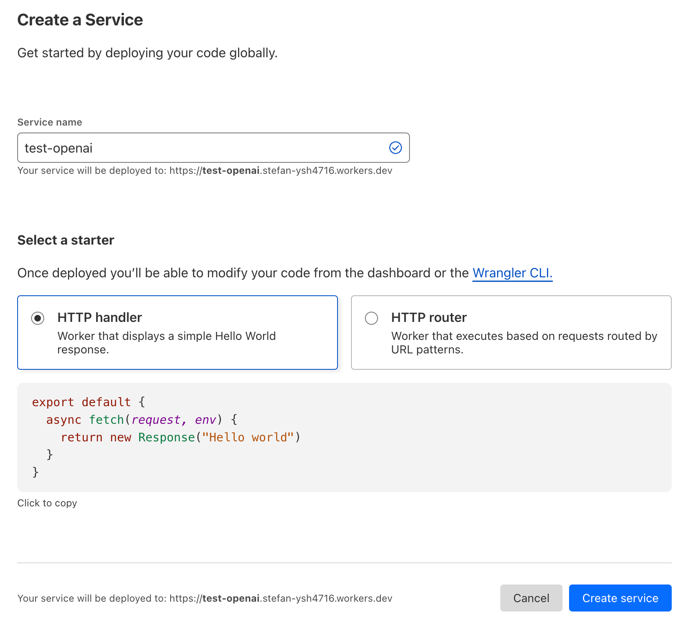
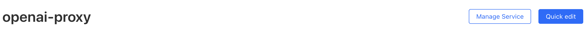
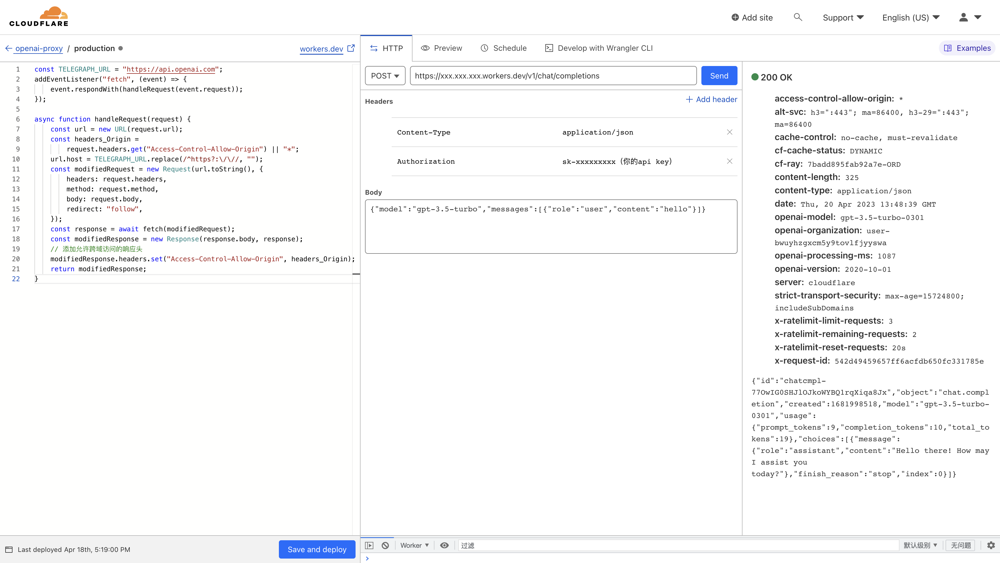

> 随着 ChatGPT 的火爆，大语言模型走入人们的视野，自此人类进入 AI 时代，许多在国内的开发者都需要使用 OpenAI GPT 的 API 来进行 NLP 相关的研究和开发，所以我也想体验下，但根据其官网的说明，该服务在中国大陆境内无法访问。为了解决这一问题，许多开发者开始寻求可用的解决方案，其中之一就是使用 Cloud flare _(以下简称 cf)_ 代理 OpenAI API。本篇文章将结合我的亲身体验，介绍如何使用 Cloudflare 代理 OpenAI API，让大家可以在国内使用它们的服务。

## 准备工作

> 假设你已经拥有一个 OpenAI 账号、一个 Cloudflare 账号，并已具备一定的编程能力。

### 1. Cloudflare 账号

首先，我们需要注册一个 Cloudflare 账号，打开 [官网](https://www.cloudflare-cn.com/)，点击右上角的 Sign Up 按钮，然后按照提示完成注册即可。

### 2. OpenAI 账号 & API Key

因为 ChatGPT 为 OpenAI 旗下产品，所以我们需要注册一个 OpenAI 账号，以便享用其服务，前面提到，OpenAI GPT 的 API 在中国大陆境内无法访问，所以我们需要注册一个海外的账号，并生成一个 api key ，详细过程此处不作赘述，可自行查阅。

## 配置 Cloudflare Worker

1. 登录 Cloudflare 账号，点击左边菜单中的 Workers 按钮，进入 Workers 页面。 点击 Create a Service 按钮，进入 Workers 编辑页面，起一个语义化的名字，比如 `openai-proxy`，然后点击 Create service 按钮。
   

2. 创建成功后，点击页面由此的 Quick edit 按钮，进入编辑页面。

   

3. 在编辑页面中，我们需要填写两个内容，一个是 API Key，一个是 Worker 脚本。

- 脚本代码

  ```js
  const TELEGRAPH_URL = "https://api.openai.com";
  addEventListener("fetch", (event) => {
    event.respondWith(handleRequest(event.request));
  });

  async function handleRequest(request) {
    const url = new URL(request.url);
    const headers_Origin =
      request.headers.get("Access-Control-Allow-Origin") || "*";
    url.host = TELEGRAPH_URL.replace(/^https?:\/\//, "");
    const modifiedRequest = new Request(url.toString(), {
      headers: request.headers,
      method: request.method,
      body: request.body,
      redirect: "follow",
    });
    const response = await fetch(modifiedRequest);
    const modifiedResponse = new Response(response.body, response);
    // 添加允许跨域访问的响应头
    modifiedResponse.headers.set("Access-Control-Allow-Origin", headers_Origin);
    return modifiedResponse;
  }
  ```

- 界面说明
  
  图中左侧为脚本代码填写处，中间是请求配置，右侧是响应预览区，到现在为止，就已经完成了 Cloudflare Worker 的配置，可以看到，右侧已经正常返回了我们的请求结果。

## 使用

你可以在你需要调用 api 接口的地方调用该接口，但是需要把 `https://api.openai.com/v1/chat/completions` 换成上图中间地址栏中的地址，即`https://xxx.xxx.xxx.workers.dev/v1/chat/completions`，也就是说用`https://xxx.xxx.xxx.workers.dev`代理了 `https://api.openai.com`

## 结语

现在已经完成了接口的代理，但是国内访问还是有困难，解决办法就是买一个域名来绑定到当前 worker 上就可以了。
