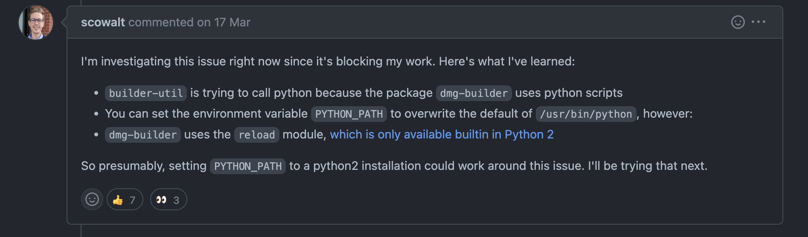

## 问题描述

使用 `electron-builder` 打包的时候，报如下错误

```shell
    ⨯ Exit code: ENOENT. spawn /usr/bin/python ENOENT  failedTask=build stackTrace=Error: Exit code: ENOENT. spawn /usr/bin/python ENOENT
        at /Users/ysh/Downloads/todolist-master/node_modules/builder-util/src/util.ts:133:18
        at exithandler (child_process.js:390:5)
        at ChildProcess.errorhandler (child_process.js:402:5)
        at ChildProcess.emit (events.js:400:28)
        at Process.ChildProcess._handle.onexit (internal/child_process.js:283:12)
        at onErrorNT (internal/child_process.js:472:16)
        at processTicksAndRejections (internal/process/task_queues.js:82:21)
    error Command failed with exit code 1.
    info Visit https://yarnpkg.com/en/docs/cli/run for documentation about this command.
```

## 分析思路

不难看出主要问题提示是这句

```shell
    ⨯ Exit code: ENOENT. spawn /usr/bin/python ENOENT  failedTask=build stackTrace=Error: Exit code: ENOENT. spawn /usr/bin/python ENOENT
```

意思是在`/usr/bin/python`这里找不到,于是百度了一下，结果少得可怜，又去 `google` 搜索了下，找到了 github 上的 issue，

大意就是

1. `dmg-builder`会用到`python`脚本，所以会在打包的时候寻找`python`
2. 系统默认和真实`python`地址不同，导致找不到，我们要做的就是更改 `PYTHON_PATH`把默认的`/usr/bin/python` 覆盖掉
3. `dmg-builder`需要重载`module`，这只在`python 2.x`版本中支持

## 最终解决

总结其实一共就俩步：

1. 官网下载 `python2.7` _[自行下载](https://www.python.org/downloads/macos/)_
2. 设置 `python_path`

```shell
    $ which python
    /Library/Frameworks/Python.framework/Versions/2.7/bin/python
```

```shell
    export PYTHON_PATH="/Library/Frameworks/Python.framework/Versions/2.7/bin/python"
```

然后再重新执行 electron 打包命令就成功了

## 参考

- [Exit code: ENOENT. spawn /usr/bin/python error after updating macOS #6726](https://github.com/electron-userland/electron-builder/issues/6726)
- [记录 MacOS 更新到 12.3，electron 打包 ENOENT. spawn /usr/bin/python ENOENT 错误](https://juejin.cn/post/7086009108481966088)
